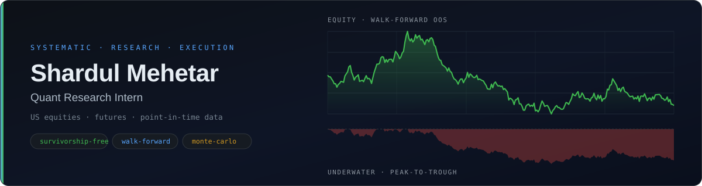

<div align="center">
  
</div>

<div align="center">

[](#)
[](#)
[](#)
[](#)
[](#)
[](#)
[](#)
[](#)

</div>

---

## About

I build **research and execution infrastructure for systematic trading** — the unglamorous
layer that decides whether a backtest is telling you the truth.

Most of my work sits in two places: **point-in-time market data** (so a strategy only ever
sees what was actually knowable on the signal date) and **validation machinery**
(walk-forward, Monte Carlo, cost modelling) that kills strategies before they reach capital.

Currently a **quant research intern**, working across US equities and index futures.

```text
research  →  point-in-time universe  →  signal  →  cost-aware fill  →  walk-forward  →  Monte Carlo  →  paper  →  live
                                                                            ↑
                                                            most ideas die here, on purpose
```

---

## Selected Work

| Repository | What it is |
| :--- | :--- |
| **[SP500-Survivorship-bias-data-2004-2026](https://github.com/shardul0701/SP500-Survivorship-bias-data-2004-2026)** | Point-in-time S&P 500 membership, 2004 → 2026, in canonical YAML. Every addition and removal is dated, so you can reconstruct the exact index on any historical day — including the names that got deleted. Post-2019 changes reconciled against official S&P Global announcements. |
| **[NQ100-Survivorship-bias-data-2004-2026](https://github.com/shardul0701/NQ100-Survivorship-bias-data-2004-2026)** | The same treatment for the Nasdaq-100: yearly membership-change files plus a universe builder that answers *"which tickers were in the index on this date?"* |
| **[Russell-Survivorship-bias-data-2004-2026](https://github.com/shardul0701/Russell-Survivorship-bias-data-2004-2026)** | Russell 3000 and Russell 2000 point-in-time rosters — 46 YAML files spanning 2004 → 2026, built in the same schema as the two above. |
| **[july-backtester](https://github.com/shardul0701/july-backtester)** | Portfolio backtesting engine I work in daily: Monte Carlo robustness scoring, walk-forward analysis, VIX regime heatmaps, √ADV market-impact slippage, and ML-ready trade feature export. |

> The three PIT datasets share one schema on purpose — swap `pit:sp500` for `pit:nq100`
> and the same strategy re-runs on a different survivorship-free universe.

---

## How I Try Not to Fool Myself

Every one of these is a way a backtest lies to you. The right column is what I actually build against it.

| Failure mode | Mitigation |
| :--- | :--- |
| **Survivorship bias** | Point-in-time constituent universes — the backtest only ever sees tickers that were genuinely in the index on the signal date. |
| **Look-ahead** | Signal generated on bar *N*, filled at *N+1* open. `shift(1)` on every regime feature, no exceptions. |
| **Overfitting** | Rolling walk-forward folds plus parameter-sensitivity sweeps — if the edge only exists at one parameter value, it isn't an edge. |
| **Path luck** | Monte Carlo resampling of the trade sequence; block bootstrap when returns are autocorrelated, so win/loss streaks survive the shuffle. |
| **Frictionless fills** | Slippage, per-share commission, √(size/ADV) market impact, and borrow cost debited daily on shorts. |
| **Same-bar ambiguity** | Explicit intrabar resolution when stop and target sit inside one bar — resolving by code order silently inflates results. |

---

## Focus Areas

<table>
<tr>
<td width="33%" valign="top">

**Data Infrastructure**

Point-in-time universes, corporate-action-adjusted price corpora, cross-vendor reconciliation, freshness overlays.

</td>
<td width="33%" valign="top">

**Strategy Research**

Cross-sectional equity momentum and mean reversion, intraday futures breakouts, regime conditioning.

</td>
<td width="33%" valign="top">

**Validation & Execution**

Walk-forward, Monte Carlo, transaction-cost modelling, paper-to-live reconciliation.

</td>
</tr>
</table>

---

<div align="center">


</div>

---

## Reach Me

[](mailto:shardulmehetar07@gmail.com)

<sub>Open to conversations about systematic research, market microstructure, and anywhere a backtest is quietly wrong.</sub>
